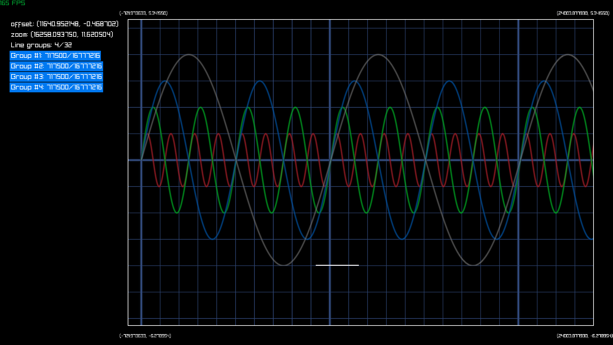

# Raylib plotter.

Smol application that plots lines that are sent to the application stdin.

### Compile

```bash
mkdir bin && \
mkdir build && \ 
make
```

## Run
rlplot is designed in such a way that it plays nicely with other unix tools. You can just pipe the output of your program to rlplot and rlplot will do it's best to plot your data.

### Examples
#### Nice Plot
```bash
# Plot numbers from 1 to 69
seq 69 | rlplot;
```

#### squre(Nice) Plot
```bash
# Plot numbers from 1 to 69
python -c "[print(x*x) for x in range(69)]" | rlplot;
```

#### Plot from data that is streamd to udp socket
```bash
nc -ulkp 42069 | rlplot;
```

#### Plot from data that is streamd to tcp socket
```bash
nc -lkp 42069 | rlplot;
```

#### Plot random data
```bash
# This will most likely crash
cat /dev/random | rlplot;
```

#### Plot temerature of core 0 on your cpu.

```bash
#Plot temeratur of core 0 on your cpu.

# Step 0: Get sensors value
sensors;
# output:
#...
#Package id 0:  +52.0°C  (high = +105.0°C, crit = +105.0°C)
#Core 0:        +52.0°C  (high = +105.0°C, crit = +105.0°C)
#Core 1:        +52.0°C  (high = +105.0°C, crit = +105.0°C)
#...

# Step 1: Grep Core 0:
sensors | grep 'Core 0';
#output:
#Core 0:        +52.0°C  (high = +105.0°C, crit = +105.0°C)

# Step 2: Get only temperature:
sensors | grep 'Core 0' | awk -p '{print $3}';
# output:
# +52.0°C 

# Step 3: Create a loop and pipe the value of core temperature to rlplot every 0.1 sec.
while :; do echo $(sensors | grep 'Core 0' | awk -p '{print $3}'); sleep 0.1; done | rlplot
# rlplot should not care about nonnumeric symbols So input `+52.0°C` should be fine.
```

#### Plot temerature of all cpu core 0.
```bash
while :; do echo $(sensors | grep 'Core' | awk -p '{print substr($3, 1, 4) ";" $2}'); sleep 0.1; done | rlplot
# substr is needed because "+52.0C;1" would be recogined as:
# Add 52 to group 0
# Add 1 to group 1
# substr transforms "+52.0C" to "52.0", so one awk will output lines like "52.0;0"
```

#### Udp client in python

* Write a udb client in python:
```python
import socket

client_socket = socket.socket(socket.AF_INET, socket.SOCK_DGRAM)
y_value = 69 # This can be any float32 value
group_id = 420 # This can be any int32 value
port_number = 42069 # This is a port number and it MUST be 42069
client_socket.sendto(f"{y_value};{group_id}".encode(), ("localhost", port_number))
```

Start rlplot that listens to udb port 42069:
```bash
nc -ulkp 42069 | rlplot;
```

### Controls

* Right mouse button + Move mouse - Change offse
* Mouse wheel - Change zoom
* **X** + Mouse Wheel - Change zoom only in **X** axis
* **Y** + Mouse Wheel - Change zoom only in **Y** axis
* **T** - Add test points
* **C** - Clear all points
* **R** - Reset offset and zoom to (0, 0) and (1, 1)

### Todo
* ~~Make drawing lines use buffers ( Don't use DrawLineStrip function by raylib. ) Maybe use DrawMesh? It's ok for plots with ~1'000'000 points, but I want more!~~
  * Implemented this now. For every line, 2 triangle are created. Old points are put in buffers and are drawn like that. Plotter can now handle 30'000'000 points, easy.
* When having many points ( 30'000'000 ), a few probles ocure:
  * Distante points start being rounded up/down to closest float. It don't look right.
  * ~~When zoomed out a lot. It becomes quite slow. ( I guess there is a lot of drawing of the same pixel.. )~~
    * Maybe combine few lines that are close when zoomed out... ( how to detect this ? )
    * This is partly fixed for plots where x values are sorted.
    * Problem still remains if x values aren't sorted.
  * Maybe use geometry shader ( don't generate triangles on cpu. )
  * ~~Gpu memory usage will be lower. Current gpu memory usage:~~
    * (N lines)*(2 triangles per line)*(3*vertices per triangle)*((3 floats for position) + (3 float for tangents))*(4 bytes per float)
    * If N = 64'000'000, gpu usage will be ~9GB. This seems high...
    * This is partly fixed. If plot values are sequential gpu memory usage can be constant with regard to number of points.
    * Problem still remains if x values aren't sorted.
* ~~I'm not happy with the thickness of the line when zooming in and out.~~
  * ~~It's not that bad, but it's inconsistent.~~
  * Made is consistent. And now it's smooth af.

### Screenshot



### License

MIT
