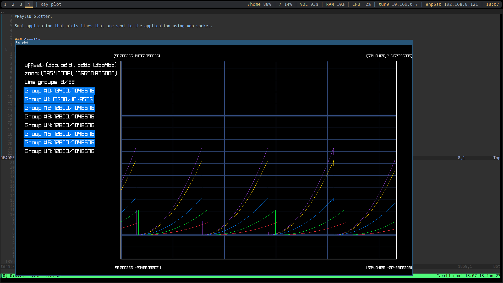

# Raylib plotter.

Smol application that plots lines that are sent to the application using udp socket.

### Compile

```bash
mkdir bin && \
mkdir build && \ 
make
```

### Run

```bash
./bin/rlplot
```

### Usage

* Write a udb client in your favorite language e.g. python:
```python
import socket

client_socket = socket.socket(socket.AF_INET, socket.SOCK_DGRAM)
```
* Use that client to send data to plotter:
```python
y_value = 69 # This can be any float32 value
group_id = 420 # This can be any int32 value
port_number = 42069 # This is a port number and it MUST be 42069
client_socket.sendto(f"{y_value};{group_id}".encode(), ("localhost", port_number))
```


### Controls

* Right mouse button + Move mouse - Change offse
* Mouse wheel - Change zoom
* **X** + Mouse Wheel - Change zoom only in **X** axis
* **Y** + Mouse Wheel - Change zoom only in **Y** axis
* **T** - Add test points
* **C** - Clear all points
* **R** - Reset offset and zoom to (0, 0) and (1, 1)

### Todo
* ~~Make drawing lines use buffers ( Don't use DrawLineStrip function by raylib. ) Maybe use DrawMesh? It's ok for plots with ~1'000'000 points, but I want more!~~
  * Implemented this now. For every line, 2 triangle are created. Old points are put in buffers and are drawn like that. Plotter can now handle 30'000'000 points, easy.
* When having many points ( 30'000'000 ), a few probles ocure:
  * Distante points start being rounded up/down to closest float. It don't look right.
  * When zoomed out a lot. It becomes quite slow. ( I guess there is a lot of drawing of the same pixel.. )
    * Maybe combine few lines that are close when zoomed out... ( how to detect this ? )
* I'm not happy with the thickness of the line when zooming in and out.
  * It's not that bad, but it's inconsistent.

### Screenshot



### License

MIT
